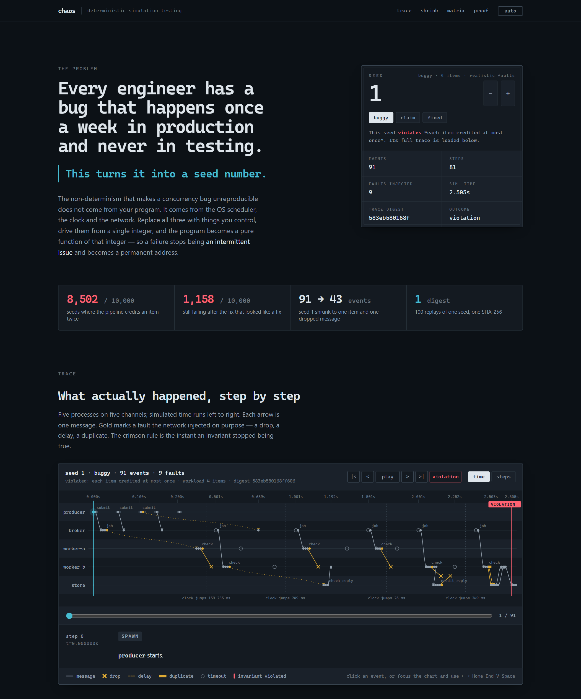

# Deterministic Testing

**Live demo: <https://kalash-somnathe.github.io/deterministic-testing/>** — real recorded
runs of this framework in the browser: step through a failing trace event by event, see
what shrinking removed, and look up other seeds. It is a static page; nothing to install.

[](https://kalash-somnathe.github.io/deterministic-testing/)

Every engineer has a bug that happens once a week in production and never in
testing. You have seen the ticket. Two rows in the ledger where there should be
one, on a Tuesday, in a service whose tests are green and whose code you have read
four times. You add a log line and wait a week. It does not happen. You remove the
log line and it happens twice.

`deterministic-testing` turns that bug into a seed number.

The non-determinism that makes concurrency bugs unreproducible does not come from
your program. It comes from outside it: the operating system's scheduler, the
clock, the network. Replace all three with things you control, drive them all from
a single integer, and your program becomes a pure function of that integer. Run
ten thousand integers overnight. When one of them fails, you have not found "an
intermittent issue" — you have found a permanent address for the bug, which
reproduces identically on your laptop, on your colleague's, and in CI, forever.

This is the technique Amazon and FoundationDB used to build storage systems people
trust. This is a small, honest implementation of it, with a worked example.

---

## The 60-second version

```
$ deterministic-testing search --seeds 1000
searching seeds 0..999 [faults=realistic items=4 worker=buggy]
2 seeds run (completed=1, violation=1); 1 failing

first failing seed: 1  (violation)
  each item credited at most once: duplicate credits for ['item-0']; credits=['item-0', 'item-0'] total=2

$ deterministic-testing shrink 1 --focus
shrank 91 events / 9 faults -> 43 events / 1 faults in 12 candidate runs

minimal scenario: seed=1 workload=1 faults=1
invariant violated: each item credited at most once
faults required:
  - DROP(msg=6)
```

One item. One dropped message. That is the entire bug.

Meanwhile the conventional test suite for the same code passes 1,000 consecutive
runs (`tests/test_pipeline.py::test_buggy_pipeline_passes_a_thousand_consecutive_runs`).

---

## How it works

Four substitutions, all driven by one seed.

**1. Processes are generators, not threads.** A process yields a description of
what it wants — send this, wait for that, sleep for thirty seconds — and the
scheduler decides when it gets it.

```python
def worker(name):
    while True:
        job = yield Recv(timeout=30.0, match=is_job)
        if job is None:
            return
        yield Send("store", {"op": "apply", "key": job.payload["key"]})
        reply = yield Recv(timeout=0.25)
```

This is the central design decision and it is deliberate. Real threads are
scheduled by the OS; you cannot record the schedule and you cannot replay it, so
you would lose determinism, which is the entire point. It has a real cost, stated
in Limitations below.

**2. The scheduler picks the next move from the seed.** At every step it builds
the set of enabled transitions — processes that can run, messages that have
reached their delivery time — and draws one. Different seeds explore different
interleavings. Message reordering falls out for free: two deliverable messages are
two enabled transitions, and which goes first is the seed's decision.

**3. Time is virtual.** The clock moves only when nothing is enabled, and then it
jumps straight to the next scheduled instant. A 30-second idle timeout costs zero
wall-clock time. Measured on this machine: 10,000 seeds of the corrected pipeline
take 21 seconds of wall clock and cover 89 hours of simulated time, a speedup of
roughly 15,000x. Numbers in `artifacts/throughput.json`.

**4. The network misbehaves on purpose.** Drop, delay, duplicate, partition —
every decision drawn from the seed, and every decision recorded so it can be
replayed exactly or removed during shrinking.

Then: **invariants** are checked after *every* scheduler step, so a violation is
reported at the instant it occurs rather than at the end of the run; and
**shrinking** reduces a failing scenario to something a human reads once.

Nothing may call `random`, `time.time()` or `uuid4()` directly. That is not a
convention in this README — `deterministic_testing/guards.py` replaces those functions with ones
that raise for the duration of every run. A system under test that reaches for the
wall clock fails immediately, at the exact line, instead of producing a bug report
nobody can reproduce three weeks later.

---

## The worked example

`examples/pipeline.py` is a small distributed data pipeline: a producer, a broker
with at-least-once delivery and retry-on-timeout, two consumer workers, and a
store. It is written the way you would write it on a Tuesday.

### The bug

The consumer is supposed to be idempotent. It does the obvious thing:

1. ask the store whether this key has already been processed
2. if not, apply the side effect
3. record that the key is done

Steps 1 and 3 are separated by a network round trip. During that window the dedup
table still says "not seen".

### What Deterministic Testing found — seed 1, shrunk to one dropped message

```
[    2] t=  0.000000s SEND      producer   {"op":"submit","key":"item-0","amount":1} seq=1 -> broker
[    9] t=  0.001000s SEND      broker     {"op":"job","key":"item-0","attempt":1}   seq=2 -> worker-a
[   12] t=  0.002000s SEND      worker-a   {"op":"check","key":"item-0"}             seq=3 -> store
[   15] t=  0.003000s SEND      store      {"op":"check_reply","seen":false}         seq=4 -> worker-a
[   18] t=  0.004000s SEND      worker-a   {"op":"credit","key":"item-0"}            seq=5 -> store
[   21] t=  0.005000s LOG       store      credit item-0, total=1
[   22] t=  0.005000s SEND      store      {"op":"credit_reply"}                     seq=6 -> worker-a
[   22] t=  0.005000s DROP      store      seq=6                        <-- the only fault
[   26] t=  0.254000s TIMEOUT   worker-a                                <-- never reaches "mark"
[   27] t=  0.501000s TIMEOUT   broker                                  <-- no ack, redeliver
[   28] t=  0.501000s SEND      broker     {"op":"job","key":"item-0","attempt":2}   seq=7 -> worker-b
[   31] t=  0.502000s SEND      worker-b   {"op":"check","key":"item-0"}             seq=8 -> store
[   34] t=  0.503000s SEND      store      {"op":"check_reply","seen":false}         seq=9 -> worker-b
[   37] t=  0.504000s SEND      worker-b   {"op":"credit","key":"item-0"}            seq=10 -> store
[   40] t=  0.505000s LOG       store      credit item-0, total=2
[   40] t=  0.505000s VIOLATION invariant  duplicate credits for ['item-0']
```

(Reproduced verbatim in `artifacts/seed1_buggy_shrunk.txt`; the payload columns are
abbreviated above for width.)

The store's acknowledgement to `worker-a` is dropped. `worker-a` times out before
it records the key. The broker's retry lands on `worker-b`, which checks a dedup
table that still says "not seen", and credits the same item again.

Nine faults fired in the original run and the workload was four items. Shrinking
reduced it to **one item and one dropped message**, in twelve candidate runs.

The minimal scenario is a 126-byte JSON file
(`artifacts/seed1_minimal.json`) and replays with
`deterministic-testing replay 1 --plan artifacts/seed1_minimal.json`.

### The fix that was not a fix

The obvious repair is to make the check and the mark a single atomic `claim` on
the store. That closes the window and it does fix the bug above.

`deterministic-testing` then found a different one, which was not planted. Over 10,000 seeds the
"fixed" version still failed 1,158 times. From the shrunk trace of seed 11:
the network duplicated a `claim_reply(won=True)`; the spare copy sat in the
worker's mailbox; the worker's ack was delayed past the retry timeout; the broker
redelivered to the same worker; and the worker's reply-matching predicate — which
correlated on `(op, key)` — consumed the **stale duplicate** and credited a second
time. Replies needed a per-request id, not just a key.

This is the more interesting bug, and reading the code would not have found it.
See FAILURES.md.

### The measured outcome

10,000 seeds per cell, four items, `FaultConfig.realistic()`
(`artifacts/variant_matrix.json`):

| consumer | perfect network | dropping/delaying/duplicating network |
| --- | --- | --- |
| `buggy` — check, credit, mark | 10,000 pass | **8,502 violations** (first: seed 1) |
| `claim` — atomic claim, then credit | 10,000 pass | **1,158 violations** (first: seed 11) |
| `fixed` — one idempotent apply, correlated by request id | 10,000 pass | 10,000 pass |

The middle row is the one worth sitting with. The intermediate fix took the
failure rate from 85% to 12%. In production that is indistinguishable from a fix:
the bug moves from "most days" to "about weekly", which is exactly the regime
where people stop investigating and add a reconciliation job instead.

---

## Running it

Python 3.11+. No dependencies beyond the standard library; `pytest` for the tests.

```
git clone https://github.com/Kalash-Somnathe/deterministic-testing.git
cd deterministic-testing
pip install -e ".[dev]"

deterministic-testing demo                   # the whole story end to end
deterministic-testing search --seeds 1000    # hunt for a failing seed
deterministic-testing replay 1 --focus       # reproduce it, print the trace
deterministic-testing shrink 1 --focus       # reduce it to a minimal scenario
deterministic-testing verify --runs 100      # prove one seed replays identically
deterministic-testing search --seeds 5000 --variant fixed --all
pytest
```

Everything also works without installing, as `python -m deterministic_testing ...` from the
repository root.

`deterministic-testing search` takes `--checkpoint results.jsonl`, which makes a long search
resumable: each seed's outcome is written immediately and completed seeds are
skipped on a re-run.

### The tests

```
98 passed in 13.44s
```

The suite tests the framework, not just the example: determinism (same seed, 100
runs, identical SHA-256 of the full event trace), determinism across separate OS
processes with varying `PYTHONHASHSEED`, different seeds producing different
traces, virtual clock exactness, deadlock and step-limit detection, fault
injection reproducibility, fault-plan JSON round-tripping, `ddmin` correctness,
shrinking genuinely reducing and still reproducing the same named invariant, the
CLI's exit codes, and the fixed pipeline surviving 2,000 seeds.

The whole suite is green under `PYTHONHASHSEED` of `0`, `1`, `987654` and
`random`, which is checked by hand and, on two operating systems and two Python
versions, by CI.

---

## Limitations

Read this section before believing anything above.

**Interleavings are explored only at yield points.** A process runs
uninterrupted between one `yield` and the next. Two processes mutating a shared
list in that gap will never be interleaved, so **a true data race on shared memory
is invisible to this tool, by construction.** It is the right tool for
message-passing, timeouts, retries and idempotency; it is the wrong tool for
memory races, where you want a thread sanitiser. Choosing where to yield is the
main modelling skill required, and the main limit on what can be found.

**Only what you model gets tested.** `deterministic-testing` explores the behaviour of the
generators you wrote, not of your production service. If the model and the service
disagree, the model wins, and you have verified fiction. This is the same
limitation TLA+ has, and the same answer: the model is worth writing anyway,
because the act of writing it is where half the bugs surface.

**Only what you assert gets caught.** A violation is only found if an invariant
names it. `deterministic-testing` will not tell you your business logic is wrong.

**Shrinking finds something smaller, not something minimal.** Removing a fault
changes the message sequence, so shrinking is a search over configurations, each
re-run and re-checked. It reduced seed 1 from 91 events to 43; it reduced seed 11
on the `claim` variant from 141 events to only 139. The tool is much better on
some inputs than others.

**The determinism guard is a Python-level patch, not a sandbox.** Code holding a
pre-bound reference (`from time import time` at import) slips through, as does
anything inside a C extension. It raises the cost of a mistake from zero to high.

**Single process, cooperative, no parallel execution.** Searching 10,000 seeds is
embarrassingly parallel and this implementation does not parallelise it. It does
not need to yet — 10,000 seeds take about 20 seconds — but that is a property of a
small example, not a property of the design.

**What FoundationDB does that this does not:** it simulates the entire storage
engine including disk and process crashes; it runs a real production codebase
rather than a model, by making the whole system single-threaded and
deterministic from the ground up; it swarm-tests continuously on hundreds of
machines; and it biases seed selection toward interleavings that have historically
found bugs. See DEFENCE.md.

---

## Layout

```
deterministic_testing/rng.py         seeded randomness, version-pinned, named sub-streams
deterministic_testing/clock.py       integer-microsecond virtual clock
deterministic_testing/ops.py         what a process may yield
deterministic_testing/simulation.py  the deterministic scheduler; the centre of the project
deterministic_testing/network.py     latency and fault injection; record and replay modes
deterministic_testing/trace.py       canonical event log and its SHA-256 digest
deterministic_testing/guards.py      runtime enforcement of "no real clock, no real randomness"
deterministic_testing/search.py      seed search, and ddmin shrinking
deterministic_testing/cli.py         search / replay / shrink / verify / demo
deterministic_testing/errors.py      the finding types: violation, deadlock, step limit, leak
examples/pipeline.py                 the system under test, in three variants
tests/                               98 tests, including the determinism proof
artifacts/                           real output: shrunk traces, minimal scenarios, the matrix
scripts/export_web_data.py           runs the framework and writes the live demo's data
web/                                 the live demo: a static page, no build step
```

Further reading: **DEFENCE.md** for the design arguments and the honest costs;
**FAILURES.md** for what went wrong while building it, including the part where
the determinism test turned out not to work.

## Licence

MIT. See LICENSE.
